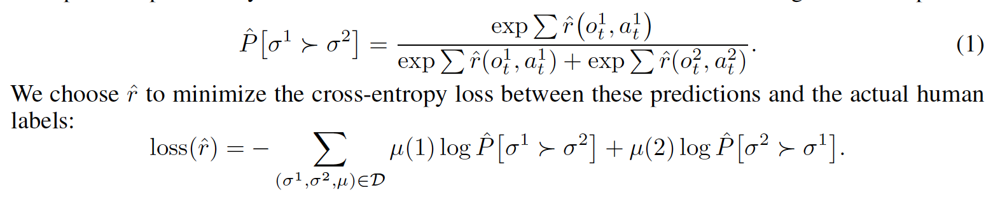

# RL Reading Note: Deep Reinforcement Learning from Human Preferences

## 1. Motivation
- Sometimes no reward function is available
- Need to decrease the number of feedback: using human feedback directly as a reward function is prohibitively expensive for RL
- It's easier for humans to provide consistent comparisons than consistent absolute scores
- Maybe: scale human feedback up to deep RL and to learn much more complex behavior

## 2. Two ways to evaluate the behavior
- **Quantitative**: preferences $\succ$ can be generated by reward function r, then the agent will seek to maximize the total rewards.  $$((o_0^1, a_0^1), ..., (o_{k-1}^1, a_{k-1}^1)) \succ ((o_0^2, a_0^2), ..., (o_{k-1}^2, a_{k-1}^2))$$ whenever $$r(o_0^1, a_0^1) +  ... +  r(o_{k-1}^1, a_{k-1}^1)\succ r(o_0^2, a_0^2) + ... + r(o_{k-1}^2, a_{k-1}^2)$$

- **Qualitative**: sometimes we don't have reward function to quantitatively evaluate the behaviors. In this case, all people can do is qualitatively evaluate how well the agent satisfies the human's preferences.

## 3. Assumptions
- There is a human overseer who can express preferences between trajectory segments.
- it's not assumed that people can reset the system to an arbitrary state (no random start)

## 4. Algorithm (asynchronous)
- **Optimize the policy**
	- Use the learned reward function $\hat{r}(o_t, a_t)$ to optimize the policy. 
	- Can use any policy gradient methods like A2C or TRPO.
	- Normalize the rewards produced by $\hat{r}(o_t, a_t)$ to have zero mean and constant std.
- **Preference Elicitation**
	- Record human judgment $(\sigma^{1}, \sigma^{2}, \mu)$
- **Fitting the Reward Function**
	- Loss function: 

	- Fit an ensemble of predictors: independently normalize each of these predictors and then average the results
	- Prevent overfitting: use $l^2$ regularization (keep validation loss between 1.1 and 1.5 times the training loss) and apply dropout.

## 5. Implementations and Experiments
- Parameters:
	- Human feedback: 1-2 sentence description
	- Length of each trajectory segment: 1 to 2 seconds
- Result:
	- Perform poorly on QBert but good on Enduro
- Understand the result:
	- Training with learned reward functions tends to be **less stable and higher variance**, while having a **comparable mean performance**.
	- By 1400 labels, the algorithm performs slightly better than if it had simply been given the true reward, perhaps because the **learned reward function is slightly better shaped**: the reward learning procedure assigns **positive rewards** to all behaviors that typically followed by high **true reward**
	- Human feedback works better when it serves as **bonus reward**
	- **Issue**: **Short clips in Qbert can be confusing and hard to evaluate**
	- For continuous control tasks, predicting comparisons work much better than predicting scores
	- Ask humans to compare longer clips is significantly more helpful per clip and significantly less helpful per frame: it is easier to compare **longer clips** because it provides **more context** than single frames.