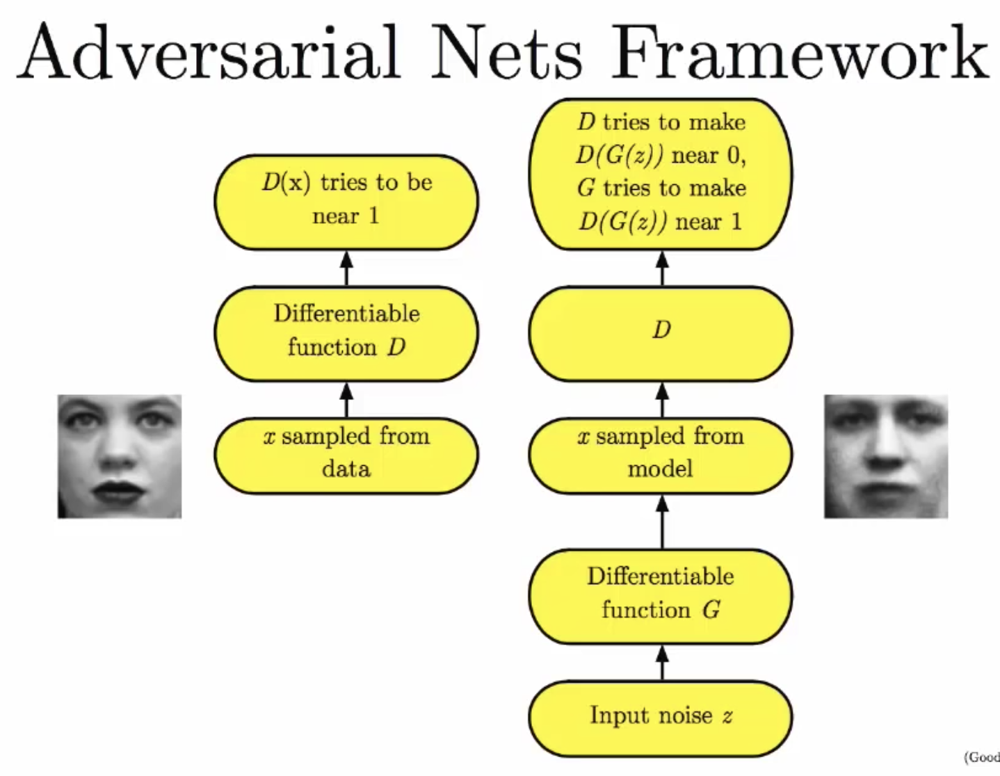

# Lecture Note: Introduction to GANs, NIPS 2016 by Ian Goodfellow

- People use adversarial training for lots of different areas almost in the situation when the **worst case** inputs are provided by another model.

- Adversarial Nets Framework

- Mode Collapse
min G max D V(G,D) not equals max D min G V(G, D) 

- Question
	- 11:00 divergence: the model will be able to learn this ratio
	- 15:00 divergence
	- 16:00 min max and max min issues

	

	

	

