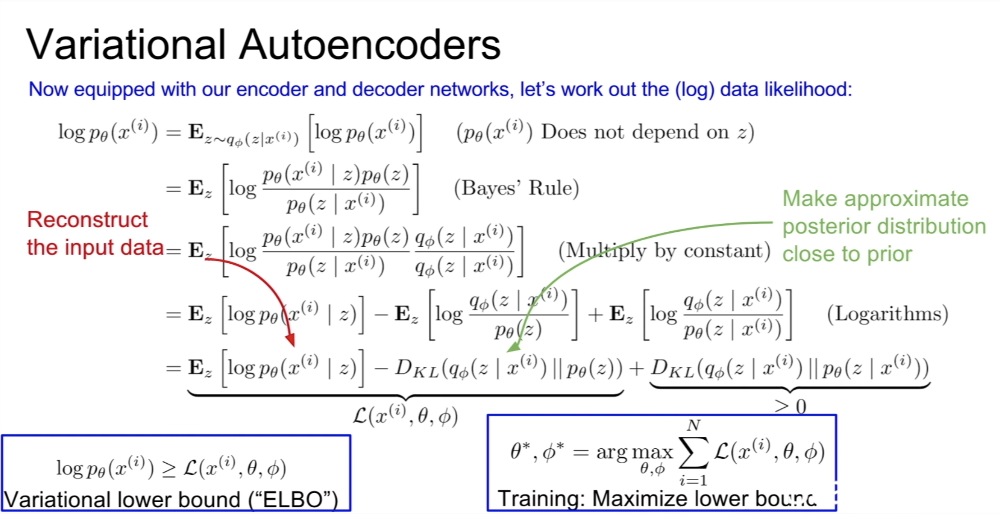
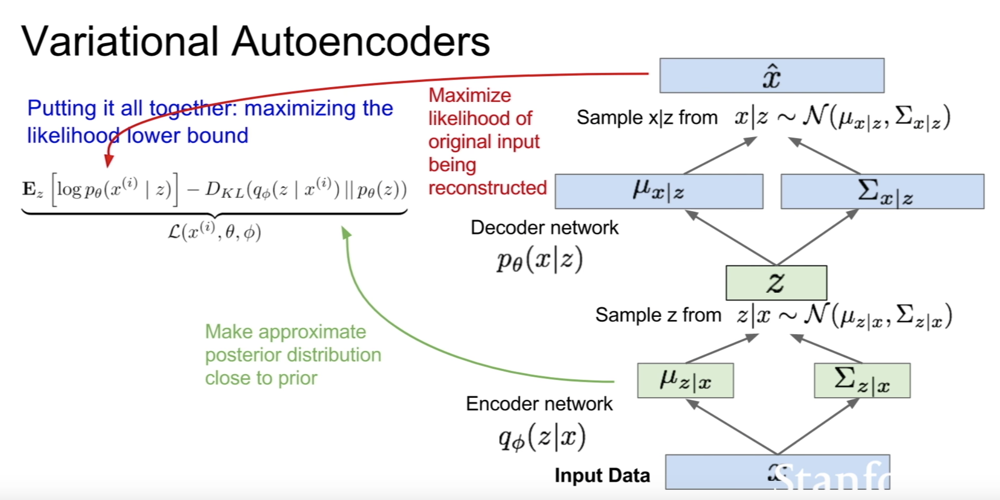
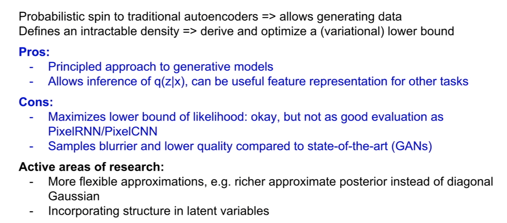
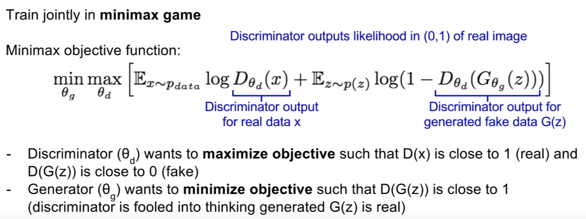
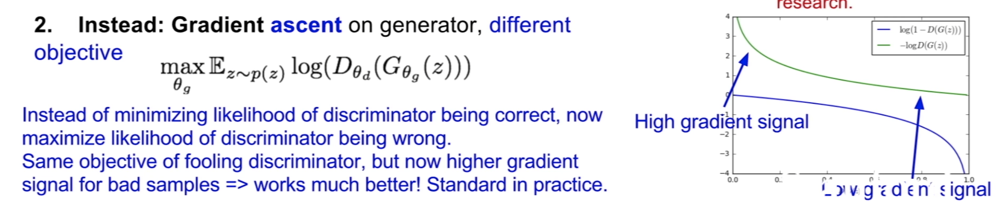

# Lecture Note: Lecture 13 - Generative Models

## Why Generative Models?
- generative models of time-series data can be used for simulation and planning (reinforcement learnig applications)

## Variational Autoencoders
- Probabilistic spin on autoencoders - will let us sample from the model to generate data

### Theory

### How it works

### Analysis

## GANs: Two-player game
### Structure
- Generator network: fool the discriminator by generating real-looking images
- Discriminator network: distinguish between real and fake images

### Loss function

**To train the model:**

- **Gradient ascent** on discriminator
- **Gradient descent** on generator
	- Since gradient descent on the generator has low gradient signal for bad samples, we use gradient ascent on generator with a refined loss function:
	

### Tricks to stablize the Deep Convolutional GANs

